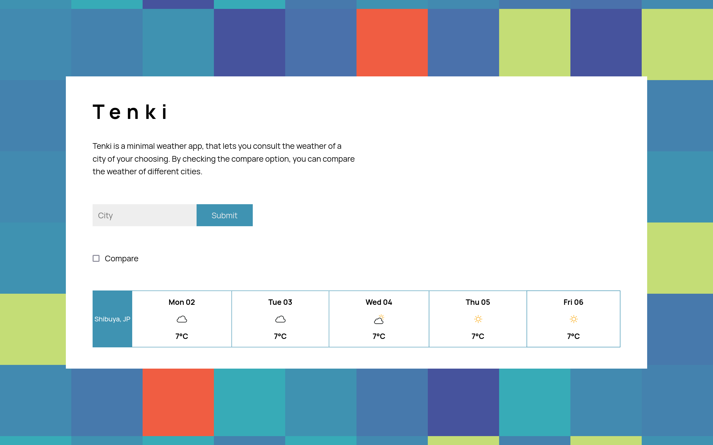

# Weather App 
An app that allows users to check the weather prediction for a given city. 
You can view the app in action [here](https://spontaneous-tartufo-6a966e.netlify.app/).



# Implementation
I split the javascript code in two files `ui.js` and `index.js`.
- `ui.js` contains all of the logic needed to manipulate the dom. The
   core functions are exported in order to be used in `index.js`:
   ```javascript
    function displayWeather(multiDayView, weekView, toCompare) {
        ...
    }
   
    function createView(data){
        ...

        return createMultiDayCardDisplay(dayCards, cityInfo);
    }

    function createMultiDayCardDisplay(dayCards, cityInfo) {
        ...
        return container;
    }

    function createDayCard(date, iconType, temparture) {
        ...
        return article;
    }

    export {displayWeather, createView};
   ```
- `index.js` serves as the main file, it is the one that will be used in the HTML. it makes use of `ui.js` by importing its exported functions: `import {displayWeather, createView} from "./ui.js";`.

In addition, the project makes use of [Vite](https://vitejs.dev/) a javascript bundler.
